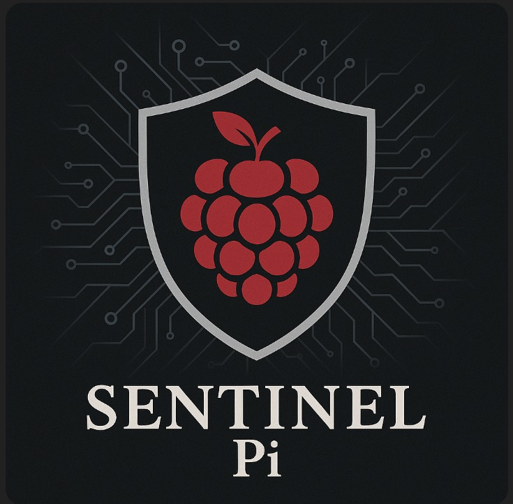
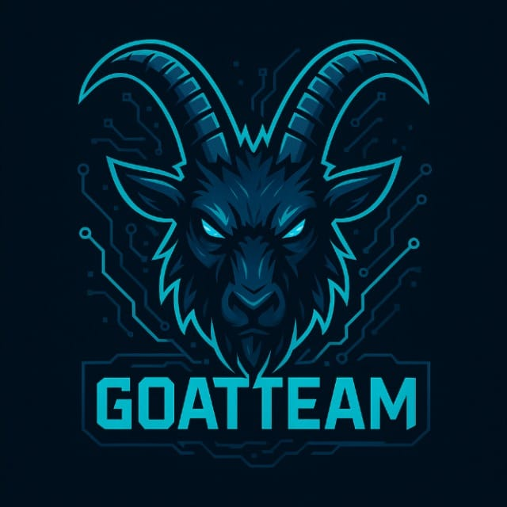
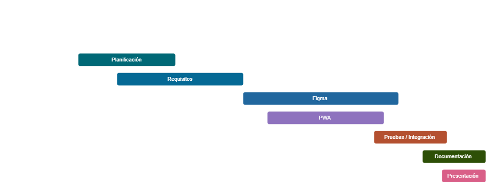

# Sentinel Pi
### Sentinel PI
---
## LOGOTIPOS

<table>
   <td>Logo de la Aplicacion</td>
   <td>Logo de empresa</td>
  <tr>
    <td>    </td>
    <td>    </td>
   
  </tr>
</table>

### DESCRIPCION

Sentinel Pi es un sistema de ciberseguridad basado en Raspberry Pi que funciona como un honeypot inteligente, orientado a la detección temprana de amenazas y al análisis de intentos de intrusión en entornos reales. Su objetivo es ofrecer una solución accesible, escalable y adaptable, capaz de integrarse en redes de instituciones educativas, empresas u organizaciones que requieren una primera línea de defensa preventiva frente a ciberataques, sin depender exclusivamente de infraestructura costosa o compleja de administrar.

La arquitectura del sistema se centra en la Raspberry Pi como dispositivo principal, configurada para simular servicios y puntos de entrada comúnmente atacados, con el fin de atraer actividad maliciosa de manera controlada y registrar comportamientos relevantes. A diferencia de un monitoreo tradicional que solo identifica alertas generales, Sentinel Pi está diseñado para capturar trazas útiles: intentos de autenticación, comandos ejecutados, patrones de escaneo, explotación de vulnerabilidades y eventos anómalos. Estos registros se envían a una API desarrollada en Express utilizando Node, encargada de centralizar la información, validarla, almacenarla en bases de datos seguras y habilitar su consulta para análisis posterior.

Además de actuar como mecanismo de detección, Sentinel Pi incorpora un enfoque de observabilidad y aprendizaje: al consolidar los datos se facilita identificar tendencias y correlaciones, como direcciones IP recurrentes, horarios de mayor actividad, servicios más atacados y tipos de técnicas utilizadas. Esto permite generar indicadores que pueden apoyar decisiones de seguridad, por ejemplo, fortalecer configuraciones, ajustar reglas de firewall, endurecer credenciales o priorizar parches. Asimismo, el sistema está pensado para crecer de forma modular, permitiendo desplegar múltiples Raspberry Pi en distintos puntos de una red y consolidarlas en la misma plataforma de análisis, incrementando la cobertura sin elevar significativamente el costo.

Sentinel Pi no solo busca detectar ataques, sino también convertirse en una herramienta educativa y de investigación, útil para la formación práctica en ciberseguridad y para la generación de conocimiento a partir de eventos reales. Su implementación puede aportar información sobre patrones de ataque, vectores de intrusión más utilizados y métodos de evasión empleados por ciberdelincuentes, contribuyendo a la construcción de reportes, casos de estudio y ejercicios de laboratorio controlados. Con esta propuesta, se fomenta una cultura de ciberseguridad más sólida, basada en evidencia, prevención y mejora continua, fortaleciendo la capacidad de respuesta ante amenazas cada vez más frecuentes y sofisticadas.

---

### OBJETIVO GENERAL

Diseñar e implementar un sistema de seguridad pasiva basado en Raspberry Pi, que funcione como un honeypot para detectar y registrar intentos de intrusión en redes informáticas, proporcionando a las empresas e instituciones una interfaz web accesible para visualizar y analizar los intentos de ataque en tiempo real, con el fin de fortalecer sus medidas de ciberseguridad de manera proactiva.

---

### OBJETIVOS ESPECIFICOS

Configurar el Raspberry Pi como un honeypot capaz de detectar y registrar intentos de intrusión.

Mapa interactivo: Desarrollar una plataforma web que permita visualizar en tiempo real los intentos de acceso captados por el sistema.

Implementación de alertas: Implementar un sistema centralizado que recopile, almacene y analice los datos generados por el dispositivo.

Implementación de reportes eficiente: Facilitar a las instituciones el monitoreo y la comprensión de los ataques mediante gráficos, reportes y estadísticas.

Desarrollar una aplicación para dispositivos inteligentes que permita la consulta de los datos de seguridad capturados por el honeypot desde diferentes entornos.

Validar el sistema mediante pruebas en un entorno controlado simulando escenarios reales de ataque.

Asegurar que el sistema pueda escalar o adaptarse a distintas instituciones con necesidades específicas.

---

### ORGANIGRAMA DEL EQUIPO
  

---

### TABLA DE ROLES

| Nombre                          | Usuario                                               | Puesto                                                   |
| ------------------------------- | ----------------------------------------------------- | ---------------------------------------------------------|
| Leslie Janet Aparicio Castro    | [leslie-aparicio](https://github.com/leslie-aparicio) | Documentadora                                            |
| Carlos Armando Aranda Hernández | [Carlicsus](https://github.com/Carlicsus)             | Desarrollador Backend                                    |
| José Alejandro Briones Arroyo   | [brionesutxj](https://github.com/brionesutxj)         | Lider de equipo / Desarrollador del Honeypot y DecSecOps |  |
| Jazziel Rodríguez López         | [JazzoLopez](https://github.com/JazzoLopez)           | Desarrollador Backend                                    |

---
### DIAGRAMA DE GANTT

  

---
### REQUERIMIENTOS FUNCIONALES 

RF01 – Captura de Intentos de Intrusión

El sistema debe detectar y registrar automáticamente cada intento de acceso no autorizado realizado hacia los servicios simulados del honeypot en Raspberry Pi.

RF02 – Almacenamiento Centralizado de Datos

El sistema debe enviar y almacenar los registros capturados por el honeypot en un servidor central (backend), donde serán organizados para su análisis.

RF03 – Panel Web de Visualización

El sistema debe proporcionar una interfaz web que muestre en tiempo real los intentos de intrusión mediante tablas, gráficos y estadísticas.

RF04 – Mapa de Ataques en Tiempo Real

El sistema debe mostrar un mapa interactivo que geolocalice los intentos de acceso registrados por el honeypot.

RF05 – Sistema de Alertas

El sistema debe notificar a los administradores cuando se detecten patrones sospechosos o un volumen anormal de intentos de ataque.

RF06 – Generación de Reportes

El sistema debe permitir generar reportes automáticos de actividad (diarios, semanales o mensuales) que incluyan métricas, gráficas y resúmenes de intentos de intrusión.

RF07 – Acceso Móvil Multiplataforma

El sistema debe permitir que los usuarios consulten la información desde la aplicación móvil y desde la versión progresiva (PWA).

RF08 – Gestión de Usuarios y Roles

El sistema debe permitir crear, editar y gestionar usuarios con distintos niveles de permiso.

RF09 – Simulación de Servicios Vulnerables

El honeypot debe simular servicios (SSH, HTTP, Telnet u otros) para atraer y registrar actividad maliciosa real.

RF10 – Validación y Pruebas de Funcionamiento

El sistema debe ejecutarse en un entorno de pruebas controlado que permita simular diferentes escenarios de ataque para validar su correcto funcionamiento antes del despliegue final.

---
### REQUERIMIENTOS NO FUNCIONALES 

RNF01 – Rendimiento del Sistema

El sistema debe procesar hasta 100 eventos por minuto mediante la API, soportar 20 conexiones simultáneas sin degradación significativa y garantizar que al menos el 85% de las respuestas se generen en menos de 1 segundo.

RNF02 – Seguridad de la Plataforma

El sistema debe utilizar cifrado TLS, aplicar autenticación mediante tokens JWT, restringir accesos mediante roles administrativos y generar registros de auditoría de accesos y eventos relevantes.

RNF03 – Fiabilidad Operativa

El sistema debe mantener un MTBF de 7 días, tolerar desconexiones temporales del honeypot o frontend sin afectar datos, y ejecutar mecanismos de reintento ante fallos de red.

RNF04 – Disponibilidad del Servicio

El sistema debe garantizar una disponibilidad mensual del 90%, operar de manera continua 24/7, y permitir mantenimientos programados con una ventana máxima de 1 hora semanal.

RNF05 – Mantenibilidad del Sistema

El sistema debe estar desarrollado con módulos desacoplados para facilitar ampliaciones, y la API debe contar con documentación técnica generada automáticamente con Swagger.

---
### HISTORIAS DE USUARIO

1. Monitoreo inmediato

Como usuario de la aplicación, quiero visualizar en la pantalla principal un resumen claro de los incidentes más recientes, para mantenerme informado rápidamente sobre la actividad del sistema sin tener que navegar entre varias pantallas.

2. Notificaciones críticas

Como usuario, quiero recibir notificaciones instantáneas cuando ocurra una amenaza de alto riesgo, para enterarme de inmediato y tomar una decisión oportuna sin necesidad de revisar constantemente la aplicación.

3. Detalle completo de incidentes

Como usuario,quiero poder abrir cada incidente y ver una descripción detallada del evento, para comprender qué ocurrió, cuál fue su origen y qué nivel de severidad representa.

4. Análisis visual de datos

Como usuario, quiero consultar gráficas y estadísticas dentro de la aplicación, para interpretar de forma sencilla la cantidad, tipo y frecuencia de incidentes registrados en un periodo de tiempo.

5. Acceso flexible desde cualquier dispositivo

Como usuario, quiero poder iniciar sesión tanto en la app móvil como en la versión web progresiva, para acceder a mi información desde el dispositivo que me resulte más conveniente.

6. Historial organizado

Como usuario, quiero consultar un historial ordenado de todos los incidentes registrados, para revisar eventos pasados, identificar patrones y entender cómo ha evolucionado la actividad.

7. Uso sin conexión

Como usuario, quiero que la aplicación me permita consultar información reciente aun cuando no tenga internet, para mantenerme informado en momentos donde la conexión falle o sea inestable.

8. Interfaz intuitiva

Como usuario, quiero que la aplicación tenga una interfaz clara, moderna y fácil de usar, para navegar sin dificultad y encontrar rápidamente las funciones que necesito.

9. Personalización de alertas

Como usuario, Quiero configurar qué tipo de alertas deseo recibir (críticas, medias o bajas), para evitar notificaciones innecesarias y enfocarme solo en lo que considero realmente importante.

10. Exportación de información

Como usuario, quiero descargar o compartir los reportes generados por la aplicación, para utilizarlos en reuniones, análisis personales o como respaldo documental.

---
## Sketches

Son dibujos rápidos y simples usados para plasmar ideas iniciales de pantallas, flujos o funciones antes de un diseño más formal. Se centran en la estructura y en probar ideas sin detalle visual.

Características

- Trazos libres.
- Poca precisión.
- Sin colores ni tipografías.
- Enfoque funcional.
- Creación rápida para explorar ideas.

[Ver carpetas de sketches](mobile/ui/sketches/)

## Wireframes

Son representaciones en baja fidelidad que muestran la estructura y distribución de una pantalla. No tienen diseño visual final, solo bloques y jerarquía de contenido.

Características

- Base del diseño.
- Enfocados en layout y navegación.
- Sin estilo visual final.
- Representación más ordenada que un sketch.

[Ver carpetas de wireframes](mobile/ui/wireframes/)

## Mockups

Son diseños en alta fidelidad que muestran el aspecto visual casi final del producto. Incluyen colores, tipografías, tamaños y componentes detallados.

Características

- Apariencia final definida.
- Precisión visual alta.
- Útiles para revisiones y aprobación del diseño.
- No son funcionales.

[Ver carpetas de mockups](mobile/ui/mockups/)

## Prototipo

Es una versión interactiva del diseño donde se simulan flujos y navegación. Sirve para validar experiencia de usuario antes del desarrollo.

Características

- Simulación de interacciones.
- Flujo navegable.
- Permite pruebas de usabilidad.
- No es código real.

[Ver prototipo](mobile/ui/prototype/)

## Enlaces Figma
[Archivo Figma]([https://tu-url-figma](https://www.figma.com/design/3blQVC8gXMVDEy61NRoYdm/SentinelPi?node-id=1-63&t=APq8nAZ2vm2WbmwX-1))

---

## API

La API inicialmente fue desarrollada en Java, pero se decidió migrarla a Express con TypeScript por temas de optimización, simplicidad en el desarrollo y mejor manejo del entorno. Además, la implementación de seguridad por token resultó más directa y mantenible.  
El servicio se desplegó en **Koyeb** debido a su facilidad de uso y a que ofrece un plan gratuito adecuado para este proyecto.

[URL de la API](https://shared-peacock-goat-team-86189809.koyeb.app/)

---

## Web UI / Progressive Web App

Se desarrolló una aplicación web en **Angular**, diseñada como una **PWA** para permitir instalación, uso offline limitado y una experiencia más integrada en dispositivos móviles.  

[URL de la aplicación web](https://web-ui-jade-three.vercel.app/sign-in)
